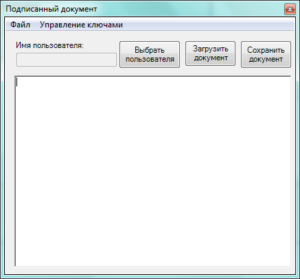
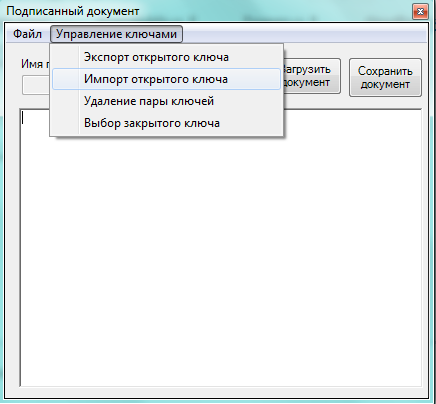

# **Лабораторная работа 1**
**Средства создания и проверки электронной подписи в системах программирования**

**Содержание задания**

1. Создать проект приложения Microsoft Visual Studio для создания прототипа системы электронного документооборота. Приложение должно обеспечивать обмен между пользователями подписанными текстовыми документами. Приложение должно позволять редактировать текстовые документы, а также сохранять и загружать их вместе с электронной подписью. Для проверки подписи в приложении необходимо обеспечить хранение открытых ключей всех участников обмена сообщениями, поэтому должны быть реализованы функции импорта/экспорта открытых ключей пользователей. Все открытые ключи из хранилища должны быть защищены от изменения и подмены с помощью электронной подписи пользователя при импорте такого ключа. На рис. 1 приведена схема распределения ключей в системе при подключении к ней нового пользователя (User1).

   

   Рис. 1. Распределение ключей в системе.

1. Примеры главной формы и интерфейса приложения приведены на рис. 2-4. Редактируемая строка под надписью «Имя пользователя» предназначена для ввода имени контейнера ключей криптопровайдера пользователя, который обеспечивает хранение пары асимметричных ключей электронной подписи (пока имя контейнера ключей не задано, работа приложения с подписанными документами невозможна). Поле с текстовым редактором под редактируемой строкой предназначено для ввода и редактирования текстов подписанных документов. Кнопка «Выбрать пользователя» на главной форме используется для переключения на новый контейнер ключей (нового пользователя). Эта кнопка дублирует команду «Выбор закрытого ключа» меню «Управление ключами». Кнопки «Загрузить документ» и «Сохранить документ» дублируют команды «Загрузить» и «Сохранить» меню «Файл».
1. Команда «Создать» меню «Файл» предназначена для создания нового документа (очищается содержимое поля с текстовым редактором, а в заголовок формы помещается текст «Подписанный документ»).
1. Команда «Сохранить» меню «Файл» предназначена для сохранения созданного (отредактированного) документа в виде массива байт вместе с вычисляемой электронной подписью и именем автора документа в папке и файле (рекомендуется с расширением sd), выбираемыми пользователем. Структура подписанного документа приведена на рис. 5. Алгоритмы электронной подписи и хеширования массива байт документа выбираются из табл. 1 в соответствии с номером варианта студента.

   

   Рис. 2. Пример главной формы приложения.

   ` `

   Рис. 3. Пример состава меню «Файл» приложения.

   

   Рис. 4. Пример состава меню «Управление ключами» приложения.

   |Длина имени подписывающего пользователя|Длина подписи|Имя подписывающего пользователя|Электронная подпись|Текст документа|
   | :-: | :-: | :-: | :-: | :-: |

   Рис. 5. Структура подписанного документа.

1. Команда «Загрузить» меню «Файл» предназначена для чтения подписанного документа из папки и файла, выбираемых пользователем, извлечения из документа имени его автора, нахождения открытого ключа автора документа в хранилище открытых ключей (например, в папке с именем PK, находящейся внутри папки с приложением), проверки подписи пользователя под открытым ключом, извлечения и проверки подписи автора под документом и отображением текста проверенного документа в поле с текстовым редактором на главной форме. Имя автора проверенного документа должно отображаться в заголовке главной формы после слов «Подписанный документ». Если документ с заданным именем не найден, отсутствует открытый ключ автора документа (он не был предварительно импортирован), не подтверждаются подписи под открытым ключом или  документом, приложение должно выводить соответствующие сообщения.
1. Команда «Выход» меню «Файл» предназначена для завершения работы приложения. Команда «О программе» меню «Файл» предназначена для вывода формы с информацией об авторе приложения (фамилии и инициалах студента, номере учебной группы и номере варианта).
1. Команда «Экспорт открытого ключа» меню «Управление ключами» предназначена для сохранения открытого ключа в виде массива байт в файле с именем владельца ключа (участника системы электронного документооборота) и расширением pub. Папка для файла с экспортируемым открытым ключом выбирается пользователем. Формат открытого ключа при экспорте приведен на рис. 6.

   |Длина имени владельца открытого ключа|Длина блоба с открытым ключом|Имя владельца открытого ключа|Блоб с открытым ключом|
   | :-: | :-: | :-: | :-: |

   Рис. 6. Формат открытого ключа.

1. Команда «Импорт открытого ключа» меню «Управление ключами» предназначена для чтения файла с ранее экспортированным открытым ключом (имя папки и файла выбираются пользователем), подписания считанных данных с помощью закрытого ключа пользователя и сохранения подписанного открытого ключа в папке-хранилище открытых ключей участников электронного документооборота (например, в папке с именем PK, находящейся внутри папки с приложением). Формат подписанного открытого ключа приведен на рис. 7. Функция импорта открытого ключа позволяет также импортировать уже подписанные ключи из хранилища открытых ключей с заменой старой подписи под ключом на заново вычисленную. Алгоритмы электронной подписи и хеширования массива байт открытого ключа выбираются из табл. 1 в соответствии с номером варианта студента.

   |Длина имени владельца открытого ключа|Длина блоба с открытым ключом|Имя владельца открытого ключа|Блоб с открытым ключом|Электронная подпись|
   | :-: | :-: | :-: | :-: | :-: |

   Рис. 7. Формат подписанного открытого ключа.

1. Команда «Удаление пары ключей» меню «Управление ключами» предназначена для удаления пары асимметричных ключей электронной подписи пользователя из его контейнера в криптопровайдере и очистки редактируемой строки с именем пользователя.
1. Команда «Выбор закрытого ключа» меню «Управление ключами» предназначена для разблокирования редактируемой строки для ввода имени пользователя (имени его контейнера ключей) и перевода фокуса ввода на эту строку. После ввода имени пользователя редактируемая строка блокируется.
1. После завершения разработки приложения провести его тестирование. Рекомендуемый порядок действий при тестировании:
   1) задать имя пользователя для себя;
   1) создать небольшой текстовый документ и сохранить его;
   1) экспортировать свой открытый ключ и импортировать его себе для того, чтобы иметь возможность читать и редактировать свои документы;
   1) передать файл со своим открытым ключом другим пользователям;
   1) получить другие файлы экспортируемых открытых ключей и импортировать открытые ключи других пользователей себе;
   1) получить и прочитать документы других пользователей;
   1) удалить свою ключевую пару.
1. Предъявить проект с разработанным приложением преподавателю для проверки и защиты лабораторной работы.

   Таблица 1

   Варианты индивидуальных заданий

   |№№ вариантов|Алгоритм хеширования документа|Алгоритм подписи документа|Алгоритм хеширования открытого ключа|Алгоритм подписи открытого ключа|
   | :-: | :-: | :-: | :-: | :-: |
   |1|MD5|RSA|MD5|RSA|
   |2|RIPEMD|RSA|SHA1|DSA|
   |3|SHA1|DSA|MD5|RSA|
   |4|SHA1|DSA|SHA1|DSA|
   |5|SHA384|RSA|SHA1|DSA|
   |6|SHA512|RSA|RIPEMD|RSA|
   |7|SHA1|DSA|RIPEMD|RSA|
   |8|SHA1|DSA|RIPEMD|ECDSA|
   |9|SHA1|RSA|SHA1|RSA|
   |10|SHA256|RSA|SHA1|DSA|
   |11|SHA384|ECDSA|SHA1|DSA|
   |12|SHA512|ECDSA|SHA1|RSA|
   |13|MD5|RSA|SHA256|RSA|
   |14|RIPEMD|RSA|SHA1|DSA|
   |15|SHA1|DSA|SHA256|RSA|
   |16|SHA256|ECDSA|SHA256|ECDSA|
   |17|SHA384|RSA|SHA1|DSA|
   |18|SHA512|RSA|SHA384|RSA|
   |19|MD5|ECDSA|SHA384|RSA|
   |20|RIPEMD|ECDSA|SHA1|DSA|
   |21|SHA1|RSA|SHA512|RSA|
   |22|SHA256|RSA|SHA512|ECDSA|
   |23|SHA384|ECDSA|SHA1|DSA|
   |24|SHA1|DSA|SHA512|RSA|
   |25|MD5|ECDSA|MD5|ECDSA|
   |26|RIPEMD|ECDSA|RIPEMD|ECDSA|
   |27|SHA1|ECDSA|SHA1|ECDSA|
   |28|SHA256|ECDSA|SHA256|ECDSA|
   |29|SHA384|ECDSA|SHA384|ECDSA|
   |30|SHA512|ECDSA|SHA512|ECDSA|
   |31|MD5|RSA|SHA1|RSA|
   |32|SHA1|DSA|SHA384|RSA|
   |33|SHA384|RSA|MD5|RSA|
   |34|SHA512|RSA|SHA1|DSA|
   |35|SHA256|RSA|SHA512|ECDSA|
   |36|SHA512|RSA|SHA256|ECDSA|
   |37|MD5|RSA|SHA1|DSA|
   |38|MD5|RSA|SHA1|ECDSA|
   |39|MD5|RSA|SHA256|ECDSA|
   |40|MD5|RSA|SHA384|RSA|
   |41|MD5|RSA|SHA512|RSA|
   |42|MD5|RSA|RIPEMD|ECDSA|
   |43|MD5|RSA|RIPEMD|RSA|
   |44|MD5|RSA|SHA384|ECDSA|
   |45|MD5|RSA|SHA512|ECDSA|
   |46|MD5|ECDSA|MD5|RSA|
   |47|MD5|ECDSA|SHA256|RSA|
   |48|MD5|ECDSA|SHA512|RSA|
   |49|MD5|ECDSA|RIPEMD|ECDSA|
   |50|MD5|ECDSA|RIPEMD|RSA|
   # **Рекомендуемые средства языка C#**
1. Классы асимметричных криптоалгоритмов для вычисления и проверки электронной подписи RSACryptoServiceProvider (реализация криптоалгоритма RSA), DSACryptoServiceProvider (реализация криптоалгоритма DSA).

   Конструкторы без параметров – инициализируют создаваемые объекты парой ключей по умолчанию.

   RSACryptoServiceProvider (CspParameters parameters) и DSACryptoServiceProvider (CspParameters parameters) – конструкторы, инициализирующие объекты на основе задаваемых параметров криптопровайдера. Класс CspParameters (параметры криптопровайдера) содержит конструктор без параметров, конструктор с параметром int dwTypeIn (тип криптопровайдера, для алгоритма DSA должен быть равен 13, для алгоритма RSA – 1, что является значением по умолчанию), а также поля string KeyContainerName (имя контейнера ключей) и int KeyNumber (тип пары асимметричных ключей, значение KeyNumber. Signature соответствует паре ключей электронной подписи).

   Свойство:

   bool PersistKeyInCsp /\* признак сохранения пары ключей в контейнере ключей криптопровайдера \*/

   Методы:

   byte[] SignHash (byte[] rgbHash, string str); /\* вычисление подписи для хеша rgbHash, вычисленного по алгоритму хеширования str; для класса DSACryptoServiceProvider значением параметра str должно быть ″ SHA1″ \*/

   bool VerifySignature (byte[] rgbHash, byte[] rgbSignature); /\* проверка подписи rgbSignature для хеша rgbHash \*/

   byte [] ExportCspBlob (	bool includePrivateParameters); /\* экспорт открытого ключа в блобе, параметр должен быть равен false \*/ 

   void ImportCspBlob (byte[] keyBlob); /\* импорт открытого ключа из задаваемого параметром блоба \*/

   void Clear(); // освобождение ресурсов криптопровайдера

   Класс ECDsaCng (реализация алгоритма DSA на эллиптических кривых, требуется версия Microsoft .Net 3.5 и выше):

   ECDsaCng (CngKey key); /\* конструктор, инициализирующий объект задаваемой параметром парой ключей \*/

   Методы:

   byte[] SignHash (byte[] hash); // вычисление подписи для заданного хеша

   bool VerifyHash (	byte[] hash, 	byte[] signature); /\* проверка подписи signature для заданного хеша hash \*/

   void Clear(); // освобождение ресурсов криптопровайдера

   Свойства:

   CngKey Key; // пара асимметричных ключей

   Методы класса CngKey:

   static CngKey Create (CngAlgorithm algorithm, 	string keyName); /\* создание новой пары ключей с именем keyName для алгоритма algorithm \*/

   static bool Exists (	string keyName); /\* проверка существования ключа с заданным именем \*/

   static CngKey Open (string keyName); /\* создание объекта для существующей пары ключей с заданным именем \*/

   void Delete(); // удаление пары ключей

   byte[] Export (CngKeyBlobFormat format); /\* экспорт открытого ключа в блобе, значением параметра должно быть CngKeyBlobFormat.EccPublicBlob \*/

   static CngKey Import (byte[] keyBlob, CngKeyBlobFormat format); /\* импорт открытого ключа из блоба keyBlob, значением параметра format должно быть CngKeyBlobFormat.EccPublicBlob \*/

1. Классы алгоритмов хеширования MD5CryptoServiceProvider (реализация алгоритма MD5), RIPEMD160Managed (реализация алгоритма RIPEMD), SHA1CryptoServiceProvider (реализация алгоритма SHA1), SHA256CryptoServiceProvider (реализация алгоритма SHA256), SHA384CryptoServiceProvider (реализация алгоритма SHA384), SHA512CryptoServiceProvider (реализация алгоритма SHA512, требуется версия Microsoft .Net 3.5 и выше).

   Конструкторы без параметров.

   Метод

   byte[] ComputeHash (byte[] buffer); // хеширование данных из массива buffer

   **Рекомендуемые средства языка Java**

1. Класс java.security.KeyPairGenerator обеспечивает создание случайной пары ключей асимметричного шифрования. Методы:

   static KeyPairGenerator getInstance (String algorithm); /\* создание объекта класса для асимметричного криптоалгоритма с длиной ключа, заданного параметром algorithm:
   DiffieHellman, DSA, RSA, EC \*/

   void initialize (int keysize, SecureRandom random); /\* инициализация генератора пары
   случайных ключей (параметр keysize задает длину ключей в битах, параметр random -
   объект с реализацией алгоритма генерации случайных чисел \*/

   KeyPair generateKeyPair (); // генерация пары ключей

Класс SecureRandom содержит конструктор без параметров (используется генератор случайных чисел без его инициализации начальным значением) и конструктор с параметром типа массива байт, задающим начальное значение генератора псевдослучайных чисел. Для получения следующей порции случайных байт используется метод

void nextBytes (byte[] bytes);

1. Класс java.security.KeyPair представляет пару асимметричных ключей. В этом классе определены методы:

   PrivateKey getPrivate (); // получение ссылки на закрытый ключ

   PublicKey getPublic (); // получение ссылки на открытый ключ
   В интерфейсах PrivateKey (java.security.PrivateKey) и PublicKey (java.security.PublicKey) определен метод

   byte[] getEncoded(); // получение значения ключа

1. Класс java.security.Signature представляет алгоритмы электронной подписи (ЭП) для двоичных данных. Методы:

   static Signature getIn stance (String algorithm); /\* создание объекта класса с реализацией криптоалгоритмов, заданных параметром algorithm: SHA1withDSA, SHA1withRSA, SHA256withRSA, SHA384withRSA, SHA512withRSA, MD2withRSA, MD5withRSA, SHA1withECDSA, SHA256withECDSA,  SHA384withECDSA, SHA512withECDSA \*/

   void initSign (PrivateKey privateKey); /\* инициализация объекта класса для вычисления ЭП (privateKey задает закрытый ключ ЭП) \*/

   void initVerify (PublicKey publicKey); /\* инициализация объекта класса для проверки ЭП (publicKey задает открытый ключ ЭП) \*/

   void update (byte[] data) ; /\* хеширование подписываемых (проверяемых) данных из буфера data \*/

   byte[] sign (); // получение ЭП для хешированных данных

   boolean verify (byte[] signature); /\* проверка ЭП signature для хешированных данных \*/

4. Для создания экземпляров классов асимметричных ключей из их значений можно использовать класс KeyFactory (java.security.KeyFactory), в котором определены методы

   static KeyFactory getInstance(String algorithm); /\* создание экземпляра класса для указанного в параметре алгоритма асимметричного шифрования \*/

   PrivateKey generatePrivate(KeySpec keySpec); /\* создание объекта с закрытым ключом по его заданной спецификации \*/

   PublicKey generatePublic(KeySpec keySpec); /\* создание объекта с открытым ключом по его заданной спецификации \*/

   Классы спецификаций асимметричных ключей PKCS8EncodedKeySpec (java.security.spec. PKCS8EncodedKeySpec) и X509EncodedKeySpec (java.security.spec.X509EncodedKeySpec) имеют конструкторы с параметром – массивом байт со значением ключа.

   **Рекомендуемые средства языка Python**

1. Получение и проверка электронной подписи (ЭП):

from Crypto.Cipher import PKCS1\_OAEP

from Crypto.PublicKey import RSA

from Crypto.Signature import pkcs1\_15

from Crypto.Hash import SHA

from Crypto.PublicKey import DSA

from Crypto.Signature import DSS

from Crypto.PublicKey import ECC

from Crypto.Hash import SHA256

from Crypto.Hash import SHA224

from Crypto.Hash import SHA384

from Crypto.Hash import SHA512

from Crypto.Hash import MD2

from Crypto.Hash import MD4

from Crypto.Hash import MD5

from Crypto.Hash import RIPEMD160

\# генерация пары ключей ЭП длиной n бит

keys=RSA.generate(n) 

keys=DSA.generate(n)

keys = ECC.generate(curve='P-256') 

keypair=keys.export\_key (format='PEM',passphrase=None,pkcs=1,protection=None,

randfunc=None) # экспорт пары ключей ЭП для сохранения

\# в формате format ('PEM' – в кодировке RFC1421/RFC1423, 'DER' – в двоичном виде),

\# в зашифрованном виде (ключ шифрования закрытого ключа выводится 
\# из парольной фразы passphrase),

\# с использованием при записи в файл кодировки ASN.1 (предполагает кодировку DER)

\# в вариантах PKCS#1 (pkcs=1) или PKCS#8 (pkcs=8),

\# со схемой шифрования protection при задании PKCS#8 

\# (PBKDF2 с HMAC-SHA1 и DES-EDE3-CBC для кодировки DER, 

\# MD5 и TripleDES для кодировки PEM),

\# с использованием функции генерации случайных чисел randfunc при кодировке PEM

\# экспорт открытого ключа ЭП для сохранения (кроме ECC)

publickey=keys.publickey().exportKey(‘PEM’)

\# экспорт открытого ключа ЭП для сохранения (ECC)

publickey = keys.export\_key(format='DER')

\# импорт пары ключей (например, из данных, считанных из файла)

keys = DSA.import\_key (keypair,passphrase=None)

keys=RSA.import\_key (keypair,passphrase=None)

keys= ECC.import\_key (keypair,passphrase=None) 

myhash=SHA.new() # хеширование данных для вычисления или проверки ЭП (кроме ECC)

myhash=SHA256.new() # хеширование данных для вычисления или проверки ЭП для ECC

myhash.update(data) # продолжение хеширования данных

myhash=myhash.digest() # получение вычисленного хеш-значения

\# создание объекта для вычисления ЭП с заданной парой ключей

signature= pkcs1\_15.new(keys)  # для RSA

signature=DSS.new(keys, 'fips-186-3') # для DSA и ECC

sig=signature.sign(myhash) # вычисление ЭП для заданного хеш-значения

\# создание объекта для проверки ЭП с заданным открытым ключом

signature= pkcs1\_15.new(publickey) 

signature= DSS.new(pubkey, 'fips-186-3')

signature.verify(myhash,sig) # проверка ЭП с генерацией исключения  ValueError 
\# при неудачной проверке

